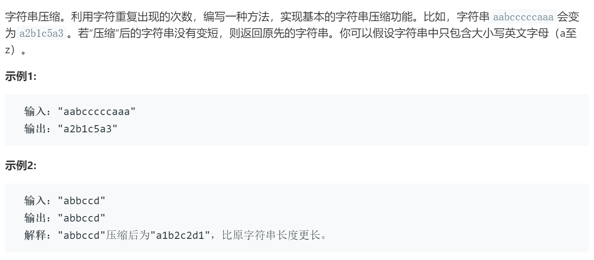

### 题目要求



### 解题思路

直接法解题。

### 本题代码

```c++
class Solution {
public:
    string compressString(string S) {
        if(S.size() == 0)
            return "";
        string res;
        int count = 1;
        res += S[0];
        char pre = S[0];
        for(int i = 1;i < S.size();i++){
            if(S[i] == S[i-1]){
                count++;
            }
            else{
                res += to_string(count);
                res += S[i];
                count = 1;
            }
            pre = S[i];
        }
        res += to_string(count);
        return res.size() >= S.size() ? S : res;
    }
};
```

### [手撸测试](https://leetcode-cn.com/problems/compress-string-lcci/)  

