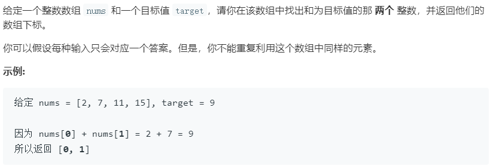

### 题目要求



### 解题思路

本题解法比较多：暴搜可以解决但是算法复杂度比较高，双指针需要首先排序数组，利用哈希表。这里列举最后一种方法--核心思路是合理使用hash帮助解决。大体做法在于固定数组中的一个数然后去找另外一个，具体看代码。

### 本题代码

```c++
class Solution {
public:
    vector<int> twoSum(vector<int>& nums, int target) {
        map<int,int>m;
        for(int i = 0;i < nums.size();i++){
            if(m.count(target - nums[i]))
                return {i, m[target - nums[i]]};
            m[nums[i]] = i;
        }
        return {};
    }
};
```

### [手撸测试](https://leetcode-cn.com/problems/two-sum/) 