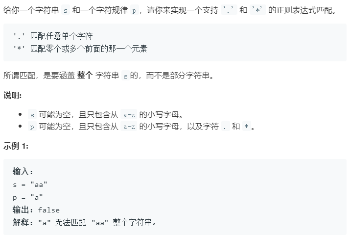

### 题目要求



### 解题思路

核心点在于`p[1]`是否是`'*'`，如果`p[1] != '*'`那就看`s`和`p`的第一个是否相同(还有一种情况`s`不空，`p`第一个为`'.'`)要满足的话就看`s`和`p`下一个匹配了，如果不满足直接返回`false`。如果`p[1] == '*'`，还是前面的情况，`s`和`p`的第一个是否相同(或者`s`不空，`p`第一个为`'.'`)，要满足的话可以选择`p`匹配多少次，如果是0次，那`s`不动，`p`往后跳两个；如果是1次或者多次，那么`s`往后跳1个，`p`不动。如果不满足，那么只能匹配0次也就是`s`不动，`p`往后跳两个。

### 本题代码

```c++
class Solution {
public:
    bool isMatch(string s, string p) {
        if(p.empty())
            return s.empty();
        if(p[1] != '*'){
            if(s[0] == p[0] || (!s.empty() && p[0] == '.'))
                return isMatch(s.substr(1), p.substr(1));
            else
                return false;
        }
        else{
            if(s[0] == p[0] || (!s.empty() && p[0] == '.'))
                return (isMatch(s, p.substr(2)) || isMatch(s.substr(1), p));
            else
                return isMatch(s, p.substr(2));
        }
    }
};
```

### [手撸测试](<https://leetcode-cn.com/problems/regular-expression-matching/>) 

