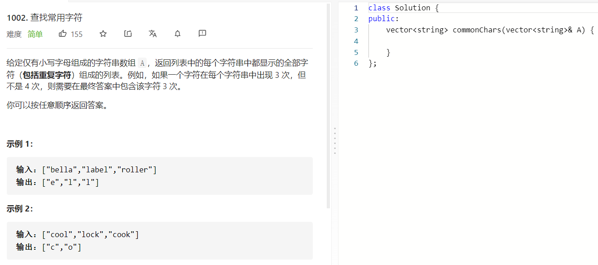

### 题目要求



### 解题思路

使用minfreq数组保存26个字母中出现次数最小的，因为共有的字符一定是所有重合出现最小的，如果没有重合就是0，因此还需要freq来记录每一个string的字符统计结果(26个字母)，这样就保证了没有的字符就会置为0.

### 本题代码

```c++
class Solution {
public:
    vector<string> commonChars(vector<string>& A) {
        if(A.size() == 0)
            return vector<string>();
        vector<string>res;
        vector<int>minfreq(26, INT_MAX);
        vector<int>freq(26, 0);
        for(string str: A){
            fill(freq.begin(), freq.end(), 0);
            for(char c: str)
                ++freq[c-'a'];
            for(int i = 0;i < 26;i++){
                minfreq[i] = min(freq[i], minfreq[i]);
            }
        }
        for(int i = 0;i < 26;i++){
            for(int j = 0;j < minfreq[i];j++){
                string s(1, i+'a');
                res.push_back(s);
            }
        }
        return res;
    }
};
```

### [手撸测试]() 

