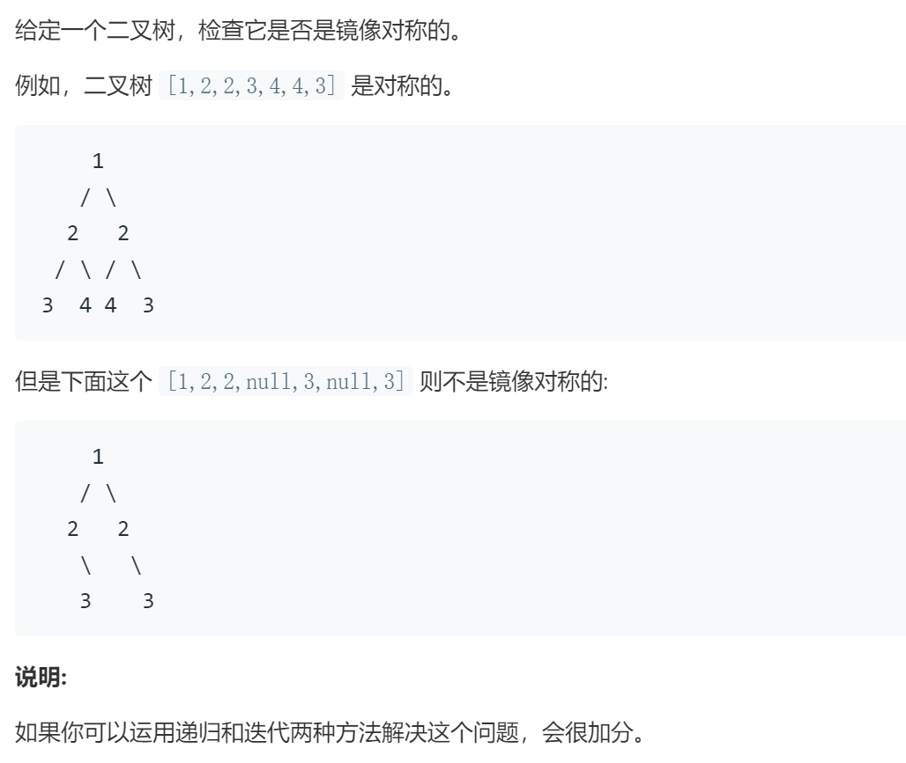

### 题目要求



### 解题思路

递归和循环两种解法。关于循环判断每一层是不是回文即可，如果节点为空就压入`INT_MIN`。

### 本题代码

#### 递归解法

```c++
class Solution {
public:
    bool isSymmetric(TreeNode* root) {
        if(!root)
            return true;
        return help(root, root);
    }
    bool help(TreeNode* t1, TreeNode* t2){
        if(!t1)
            return t2 == NULL;
        if(!t2)
            return t1 == NULL;
        if(t1->val != t2->val)
            return false;
        return help(t1->left,t2->right) && help(t1->right, t2->left);
    }
};
```

#### 循环解法

```c++
class Solution {
public:
    bool isSymmetric(TreeNode* root) {
        if(!root) return true;
        queue<TreeNode*> q;
        q.push(root);
        while(!q.empty()){
            int size = q.size();
            vector<int> v(size);
            for(int i = 0; i<size; ++i){
                root = q.front(); q.pop();
                v[i] = root ? root->val : INT_MIN;
                if(root) { q.push(root->left); q.push(root->right); }
            }
            // 判断是否回文
            for(int i = 0; i< size/2; ++i){
                if(v[i] != v[size-1-i]) return false;
            }
        }
        return true;
    }
};
```

### [手撸测试](https://leetcode-cn.com/problems/symmetric-tree/) 