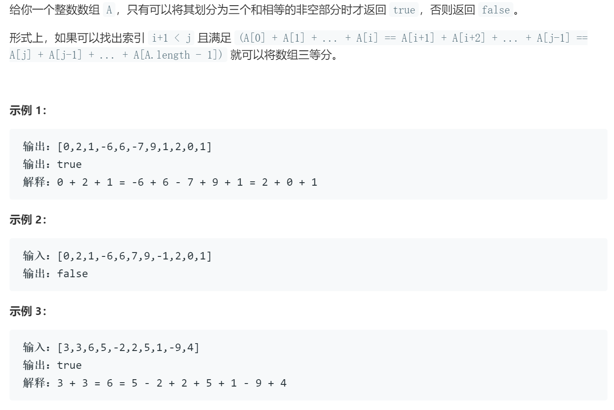

### 题目要求



### 解题思路

注意连续的子数组分成三份。如果数组和`sum%3 != 0`那么就直接返回`false`。直接法从左到右相加如果满足和相等就赋`0`并且`count`加`1`；双指针法：左右指针向里搜值。

### 本题代码

```c++
class Solution {
public:
    bool canThreePartsEqualSum(vector<int>& A) {
        if(A.size() == 0)
            return false;
        int sum = 0;
        for(auto num : A)
            sum += num;
        if(sum % 3 != 0)
            return false;
        int left = 0, right = A.size() - 1;
        int leftsum = A[left], rightsum = A[right];
        while(left + 1 < right){
            if(leftsum == sum / 3 && rightsum == sum / 3)
                return true;
            if(leftsum != sum / 3)
                leftsum += A[++left];
            if(rightsum != sum / 3)
                rightsum += A[--right];
        }
        return false;
    }
};
```

### [手撸测试](https://leetcode-cn.com/problems/partition-array-into-three-parts-with-equal-sum/)  

