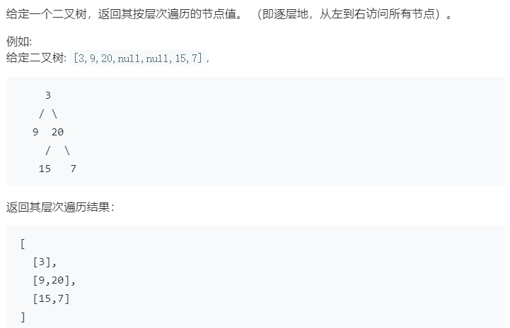

### 题目要求



### 解题思路

基础题，直接手撸即可。

### 本题代码

```c++
class Solution {
public:
    vector<vector<int>> levelOrder(TreeNode* root) {
        if(root == NULL)
            return vector<vector<int>>();
        vector<vector<int>>res;
        queue<TreeNode*>q;
        q.push(root);
        while(!q.empty()){
            int count = q.size();
            vector<int>path;
            while(count != 0){
                TreeNode* node = q.front();
                path.push_back(node->val);
                q.pop();
                if(node->left != NULL)
                    q.push(node->left);
                if(node->right != NULL)
                    q.push(node->right);
                count--;
            }
            res.push_back(path);
        }
        return res;
    }
};
```

### [手撸测试](<https://leetcode-cn.com/problems/binary-tree-level-order-traversal/>) 

