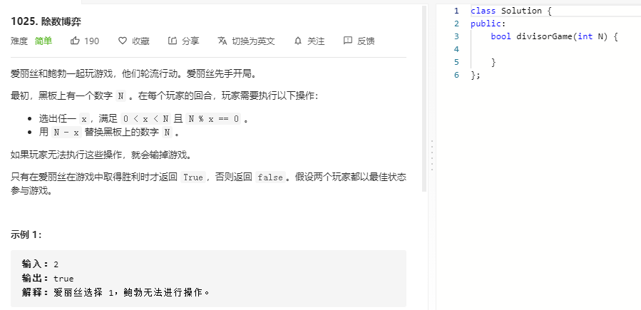

### 题目要求



### 解题思路

这个题怎么说那，一言难尽，竟然是判断奇偶的脑筋急转弯.....

若N初始若为奇数，爱丽丝先手每次都选1，鲍勃只能选择奇数，这样爱丽丝稳赢；若N初始若为奇数，那么爱丽丝第一次选完之后N必为偶数(奇数的约数一定是奇数，奇数减去奇数一定是偶数)，那么鲍勃只需一直选1就会稳赢。

### 本题代码

```c++
class Solution {
public:
    bool divisorGame(int N) {
        if(N == 0)
            return false;
        if(N % 2 == 0)
            return true;
        else
            return false;
    }
};
```

### [手撸测试](https://leetcode-cn.com/problems/divisor-game/) 

