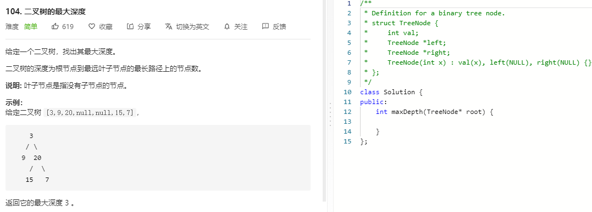

### 题目要求



### 解题思路

直接撸

### 本题代码

```c++
class Solution {
public:
    int maxDepth(TreeNode* root) {
        if(!root)
            return 0;
        int left = maxDepth(root->left);
        int right = maxDepth(root->right);
        return max(left, right) + 1;
    }
};
```

### [手撸测试](https://leetcode-cn.com/problems/maximum-depth-of-binary-tree/)  

