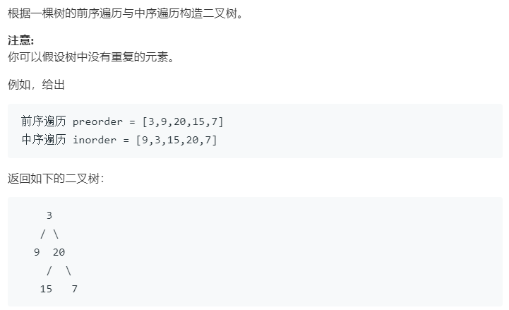

### 题目要求



### 解题思路

前序遍历的第一个节点是头节点，需要找到右数的长度以及左树的长度。为中序遍历数组建立`hash`表--保存节点值与索引的关系。这样就可以根据头节点的位置确定左右树的长度，递归构建树。

### 本题代码

```c++
class Solution {
public:
    TreeNode* buildTree(vector<int>& preorder, vector<int>& inorder) {
        if(preorder.size() != inorder.size() || inorder.size() == 0)
            return NULL;
        map<int, int>m;
        for(int i = 0;i < inorder.size();i++){
            m[inorder[i]] = i;
        }
        TreeNode* root = dfs(preorder, 0, preorder.size() - 1, inorder, 0, inorder.size() - 1, m);
        return root;
    }
    TreeNode* dfs(vector<int>& preorder, int pi, int pj, vector<int>& inorder, int ni, int nj, map<int, int>&m){
        if(pi > pj)
            return NULL;
        int root = preorder[pi];
        TreeNode* node = new TreeNode(root);
        int i = m[root];
        node->left = dfs(preorder, pi + 1, pi + i - ni, inorder, ni, i - 1, m);
        node->right = dfs(preorder, pi + i - ni + 1, pj, inorder, i + 1, nj, m);
        return node;
    }
};
```

### [手撸测试](<https://leetcode-cn.com/problems/construct-binary-tree-from-preorder-and-inorder-traversal/>) 

