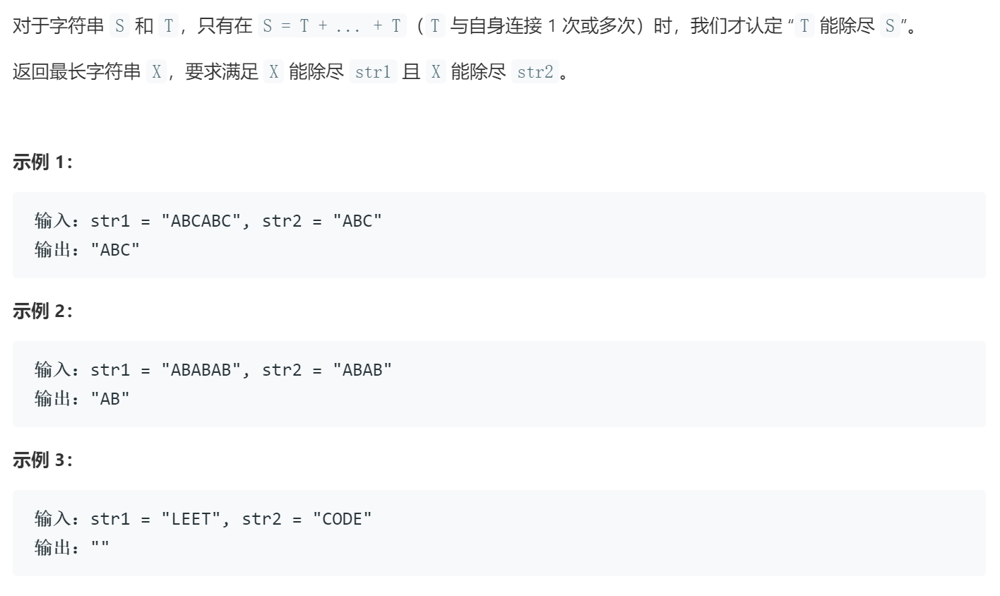

### 题目要求



### 解题思路

对于整数的最大公约数(公式要熟背，代码要熟撸)：

> 两个数大数和小数，他们两个的最大公约数是小数和大数除以小数的余数之间的公约数。
>
> ```c++
> int gcd(int a, int b){
>     if(a < b)
>         swap(a, b);
>     return b == 0 ? a : gcd(b, a % b);
> }
> ```

对于字符串来讲，巧用该思路，最大公因子的长度必然等于两串长度的最大公约数。

关于证明：

> 假设两字符串的长度分别为l1, l2, 他们的最大公约数是k。
> 现已知道两字符串存在最大公因子（第一行代码），假设该字串的长度为k'。
>
> 下面开始反证：
> 若k' < k，而根据题意k'也为l1, l2 的公约数，则k'必能被k整除，这说明我们可以将该字串的长度扩充到k，同时保持它仍然为str1和str2的公因子，所以这种情况下这个长度为k的公因子就不是最大公因子。
> 若k' > k， 根据题意k'为l1, l2 的公约数， 而k为最大公约数，而这时出现了一个比最大公约数还大的公约数，这是矛盾的，所以这种情况也是不可能的。
>
> 综合以上，最大公因子的长度必然等于两串长度的最大公约数。
>

### 本题代码

```c++
class Solution {
public:
    string gcdOfStrings(string str1, string str2) {
        if(str1.size() < str2.size() || str2.size() == 0)
            return "";
        int len = str2.size();
        int i = 0;
        string res;
        while(i < str1.size()){
            if(str1.substr(i, i+len) != )
        }
    }
};
```

### [手撸测试](https://leetcode-cn.com/problems/greatest-common-divisor-of-strings/)  

