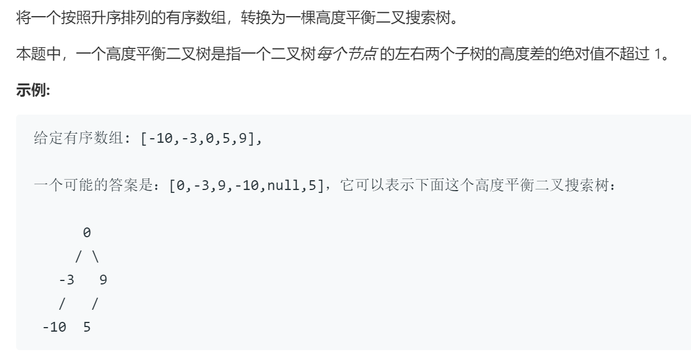

### 题目要求



### 解题思路

有序数组很能想到是二叉搜索数的中序遍历，左右高度一致很容易想到中点分割重建二叉树，这和利用先序遍历和后序遍历构建二叉树的思路结合。

### 本题代码

```c++
class Solution {
public:
    TreeNode* sortedArrayToBST(vector<int>& nums) {
        return dfs(nums, 0, nums.size());
    }
    TreeNode* dfs(vector<int>&nums, int start, int end){
        if(start == end)
            return NULL;
        int mid = start + (end - start) / 2;
        //int mid = (start + end) >>> 1;其中>>表示有符号的移位，>>>表示移位后最高位补零
        TreeNode* root = new TreeNode(nums[mid]);
        root->left = dfs(nums, start, mid);
        root->right = dfs(nums, mid+1, end);
        return root;
    }
};
```

### [手撸测试](https://leetcode-cn.com/problems/convert-sorted-array-to-binary-search-tree/)  

