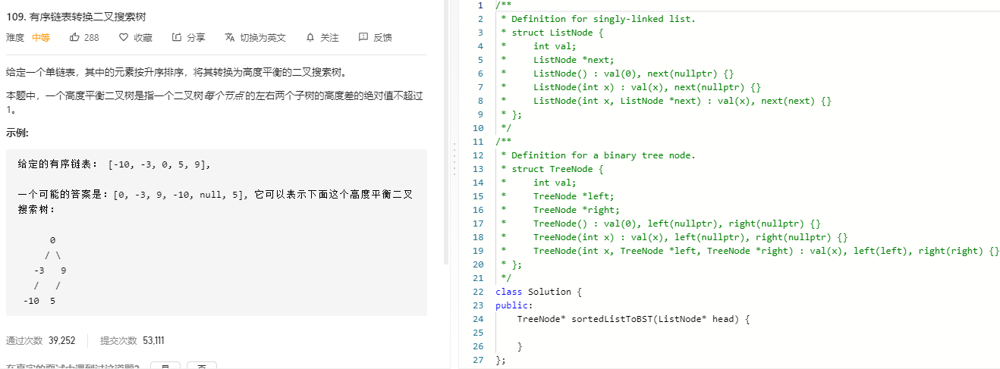

### 题目要求



### 解题思路

因为是二叉搜索树的恢复，因此找到中间节点以及中间节点的前一个结点，然后构建左右树。

### 本题代码

```c++
class Solution {
public:
    TreeNode* sortedListToBST(ListNode* head) {
        if(head == NULL)
            return NULL;
        ListNode* slow = head;
        ListNode* fast = head;
        ListNode* pre = NULL;
        while(fast && fast->next){
            pre = slow;
            slow = slow->next;
            fast = fast->next->next;
        }
        TreeNode* root = new TreeNode(slow->val);
        if(pre != NULL){//说明没有左树了
            pre->next = NULL;
            root->left = sortedListToBST(head);
        }
        root->right = sortedListToBST(slow->next);
        return root;
    }
};
```

### [手撸测试](https://leetcode-cn.com/problems/convert-sorted-list-to-binary-search-tree/)  

