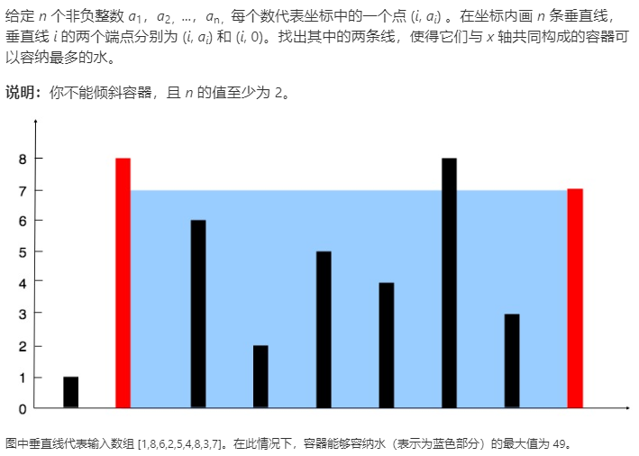

### 题目要求



### 解题思路

双指针解法。定义左指针`i`以及右指针`j`，面积的更新是$$max(res, height[i] * (j - i)) \  \ if(height[i] < height[j]) $$，然后左指针更新，同理右指针得更新也是一样。

### 本题代码

```c++
class Solution {
public:
    int maxArea(vector<int>& height) {
        if(height.size() == 0)
            return 0;
        int i = 0;
        int j = height.size() - 1;
        int res = 0;
        while(i < j){
            if(height[i] < height[j]){
                res = max(res, height[i] * (j - i));
                i++;
            }
            else{
                res = max(res, height[j] * (j - i));
                j--;
            }
        }
        return res;
    }
};
```

### [手撸测试](<https://leetcode-cn.com/problems/container-with-most-water/>)  

