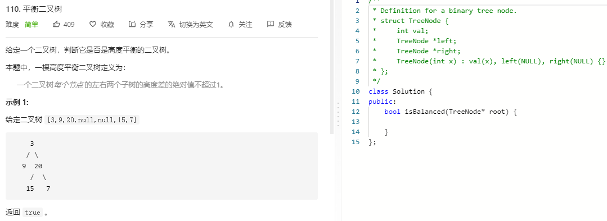

### 题目要求



### 解题思路

只要求得左右树的高度，然后判断是否满足平衡树的条件即可。

### 本题代码

```c++
/**
 * Definition for a binary tree node.
 * struct TreeNode {
 *     int val;
 *     TreeNode *left;
 *     TreeNode *right;
 *     TreeNode(int x) : val(x), left(NULL), right(NULL) {}
 * };
 */
class Solution {
public:
    bool isBalanced(TreeNode* root) {
        if(root == NULL)
            return true;
        return helper(root) >= 0;
    }
    int helper(TreeNode* root){
        if(root == NULL)
            return 0;
        int left = helper(root->left);
        int right = helper(root->right);
        if(left == -1 || right == -1 || (left - right > 1 || left - right < -1))
            return -1;
        return max(left, right) + 1;
    }
};
```

### [手撸测试](https://leetcode-cn.com/problems/balanced-binary-tree/)  

