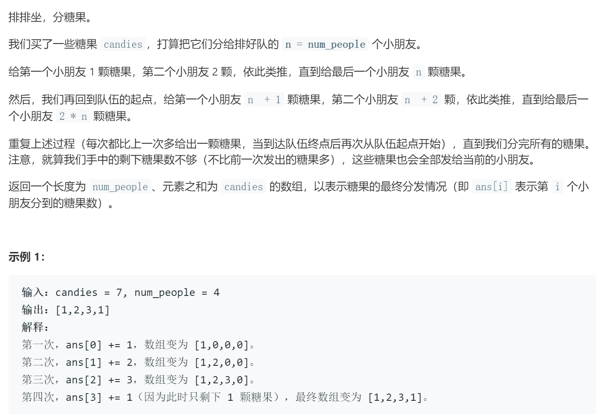

### 题目要求



### 解题思路

每个小朋友的位置为`index`，那么在多轮发糖中的位置为$$index \% num\_people $$，每次发的糖为`can`变量从1开始，每次加一。

### 本题代码

```c++
class Solution {
public:
    vector<int> distributeCandies(int candies, int num_people) {
        vector<int>vec(num_people, 0);
        int index = 0, can = 1;
        while(candies - can >= 0){
            vec[index % num_people] += can; //原来的加上第n轮的糖
            candies -= can;
            can++;
            index++;
        }
        vec[index % num_people] += candies;//别忘了没有发全
        return vec;
    }
};
```

### [手撸测试](https://leetcode-cn.com/problems/distribute-candies-to-people/)  

