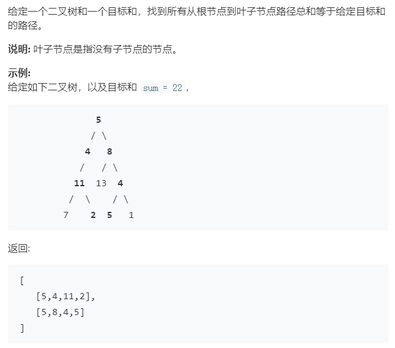

### 题目要求



### 解题思路

不用多bb，上去就是回溯。注意要求是要到叶子节点的，因此添加条件要满足该节点是叶子节点。

### 本题代码

```c++
class Solution {
public:
    vector<vector<int>> pathSum(TreeNode* root, int sum) {
        vector<vector<int>>res;
        vector<int>path;
        dfs(root, sum, res, path);
        return res;
    }
    void dfs(TreeNode* root, int sum, vector<vector<int>>& res, vector<int>& path){
        if(root == NULL)
            return;
        path.push_back(root->val);//先序遍历时先对该节点操作
        sum -= root->val;
        if(root->left == NULL && root->right == NULL && sum == 0){
            res.push_back(path);
            //return; 这个return不能有，一旦return了后面就没有该上节点其他的回溯
        }
        dfs(root->left, sum, res, path);
        dfs(root->right, sum, res, path);
        path.pop_back();
        sum += root->val;
    }
};
```

### [手撸测试](<https://leetcode-cn.com/problems/path-sum-ii/>) 
