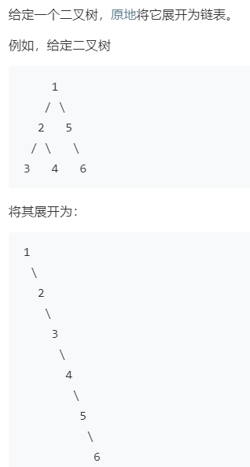

### 题目要求



### 解题思路

递归法通吃。写的时候记住一个概念，后续遍历后，左树已经成为链表，右树也成为链表，那么就是将左树连到根节点右边后，右树连在左树之后，根节点的左树边为空。

### 本题代码

```c++
class Solution {
public:
    void flatten(TreeNode* root) {
        if(root == NULL)
            return;
        flatten(root->left);
        flatten(root->right);
        if(root->left == NULL)
            return;
        TreeNode* pre = root->left;
        while(pre->right != NULL)
            pre = pre->right;
        pre->right = root->right;
        root->right = root->left;
        root->left = NULL;
    }
};
```

### [手撸测试](<https://leetcode-cn.com/problems/flatten-binary-tree-to-linked-list/>) 

