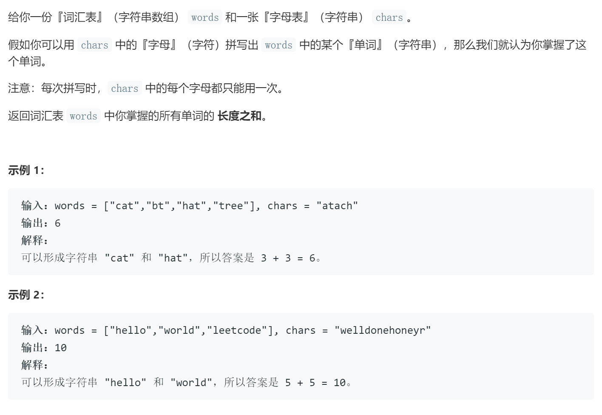

### 题目要求



### 解题思路

哈希方法。维护两个哈希表，思路很直接。

### 本题代码

```c++
class Solution {
public:
    int countCharacters(vector<string>& words, string chars) {
        if(words.size() == 0 || chars.size() == 0)
            return 0;
        unordered_map<char, int>m;
        for(auto c : chars)
            ++m[c];
        int res = 0;
        for(auto word : words){
            unordered_map<char, int>w;
            for(auto s : word)
                ++w[s];
            bool flag = true;
            for(auto s : word){
                if(m[s] < w[s]){
                    flag = false;
                    break;
                }
            }
            if(flag)
                res += word.size();
        }
        return res;
    }
};
```

### [手撸测试](https://leetcode-cn.com/problems/find-words-that-can-be-formed-by-characters/)  

