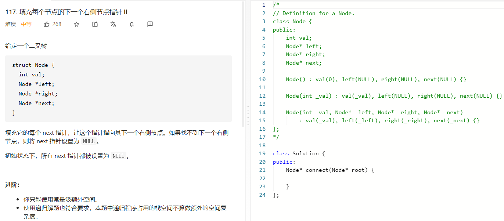

### 题目要求



### 解题思路

解法1：O(N)的算法复杂度以及O(N)的时间复杂度，直接套用BFS然后得出结果。

解法2：O(1)的算法复杂度以及O(N)的时间复杂度，核心在于每一次便利第i就可以将第i+1层的next串联起来。root那一层不需要串联

### 本题代码

解法1

```c++
class Solution {
public:
    Node* connect(Node* root) {
        queue<Node*>q;
        if(root == NULL)
            return root;
        q.push(root);
        while(!q.empty()){
            int size = q.size();
            Node* pre = NULL;
            for(int i = 0;i < size;i++){
                Node* node = q.front();
                if(pre != NULL)
                    pre->next = node;
                if(node->left)
                    q.push(node->left);
                if(node->right)
                    q.push(node->right);
                pre = node;
                q.pop();
            }
        }
        return root;
    }
};
```

解法2

```c++
class Solution {
public:
    void helper(Node* &last, Node* &p, Node* &newStart){
        if(last)
            last->next = p;
        if(!newStart)
            newStart = p;
        last = p;
    }
    Node* connect(Node* root) {
        if(root == NULL)
            return root;
        Node* start = root;
        while(start){
            Node* last = NULL;
            Node* newStart = NULL;
            for(Node* p = start;p != NULL;p=p->next){
                if(p->left)
                    helper(last, p->left, newStart);
                if(p->right)
                    helper(last, p->right, newStart);
                
            }
            start = newStart;
        }
        return root;
    }
};
```

### [手撸测试](https://leetcode-cn.com/problems/populating-next-right-pointers-in-each-node-ii/)  

