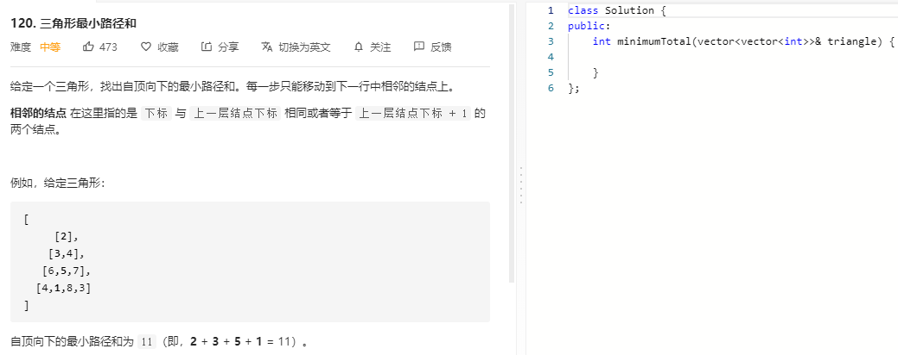

### 题目要求



### 解题思路

动态规划。`dp[i][j]`表示的是三角形中第`i`行第`j`个元素的累计最小值，注意每一行第一个元素以及最后一个元素的相邻节点只有一个，需要额外计算。

### 本题代码

```c++
class Solution {
public:
    int minimumTotal(vector<vector<int>>& triangle) {
        int n = triangle.size();
        int m = triangle[n-1].size();
        vector<vector<int>>dp(n, vector<int>(m, 0));
        dp[0][0] = triangle[0][0];
        for(int i = 1;i < m;i++){
            int j = 0;
            dp[i][j] = dp[i-1][j] + triangle[i][j];
            j++;
            for(;j < triangle[i].size()-1;j++){
                dp[i][j] = min(dp[i-1][j], dp[i-1][j-1]) + triangle[i][j];
            }
            dp[i][j] = dp[i - 1][j - 1] + triangle[i][j];
        }
        int res = INT_MAX;
        for (int j = 0; j < m; j++) {
            res = min(res, dp[n - 1][j]);
        }
        return res;
    }
};
```

### [手撸测试](https://leetcode-cn.com/problems/triangle/)  

