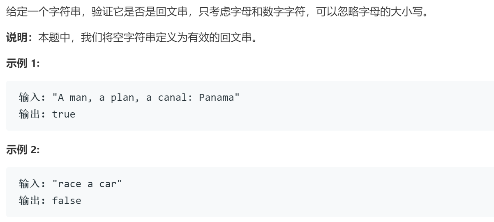

### 题目要求



### 解题思路

双指针可以解决问题。学习`c++`的两个函数转换小写`tolower()`以及判断非字符数字函数`isalnum()`。

### 本题代码

```c++
class Solution {
public:
    bool isPalindrome(string s) {
        string str = "";
        for(auto c: s) 
            if(isalnum(c)) 
                str += tolower(c);
        for(int i=0, m=str.size(); i<m/2; ++i)
            if(str[i] != str[m-1-i]) return false;
        return true;
    }
};
```

### [手撸测试](https://leetcode-cn.com/problems/valid-palindrome/)  

