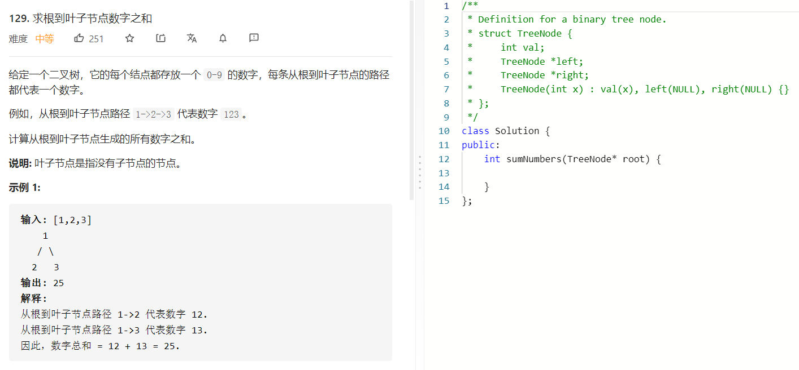

### 题目要求



### 解题思路

很简单的题，直接手撸即可。

### 本题代码

```c++
class Solution {
public:
    int res = 0;
    int sumNumbers(TreeNode* root) {
        int path = 0;
        dfs(root, path);
        return res;
    }
    void dfs(TreeNode* root, int& path){
        if(root == NULL)
            return;
        path = path*10 + root->val;
        if(root->right == NULL && root->left == NULL)
            res += path;
        dfs(root->left, path);
        dfs(root->right, path);
        path = path / 10;
    }
};
```

### [手撸测试](https://leetcode-cn.com/problems/sum-root-to-leaf-numbers/)  

