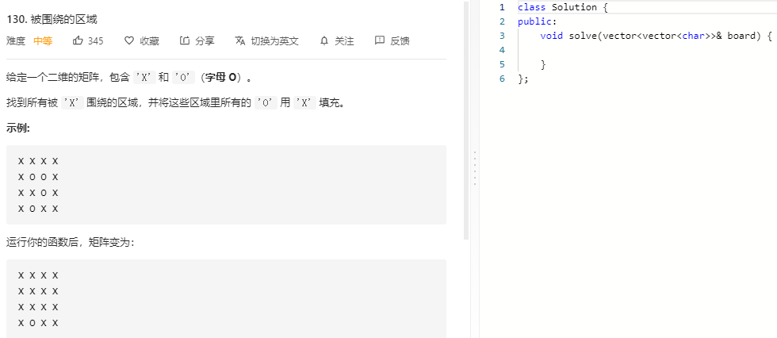

### 题目要求



### 解题思路

要将被X包围的O变成X，同时与所有边界上O相连的O不变化。可以使用反向思维，也就是从边界的O入手，将与其相连的所有O都变成一个特殊符号A，这样按行列遍历之后，将没有变成A的O变成X，将A变成O即可。

### 本题代码

```c++
class Solution {
public:
    void dfs(vector<vector<char>>& board, int x, int y){
        int n = board.size();
        int m = board[0].size();
        if(x >= n || x < 0 || y >= m || y < 0 || board[x][y] != 'O')
            return;
        board[x][y] = 'A';
        dfs(board, x+1, y);
        dfs(board, x-1, y);
        dfs(board, x, y+1);
        dfs(board, x, y-1);
    }
    void solve(vector<vector<char>>& board) {
        if(board.size() == 0)
            return;
        int n = board.size();
        int m = board[0].size();
        for(int i = 0;i < n;i++){
            dfs(board, i, 0);
            dfs(board, i, m-1);
        }
        for(int i = 0;i < m;i++){
            dfs(board, 0, i);
            dfs(board, n-1, i);
        }
        for(int i = 0;i < n;i++){
            for(int j = 0;j < m;j++){
                if(board[i][j] == 'A')
                    board[i][j] = 'O';
                else if(board[i][j] == 'O')
                    board[i][j] = 'X';
            }
        }
    }
};
```

### [手撸测试](https://leetcode-cn.com/problems/surrounded-regions/)  

