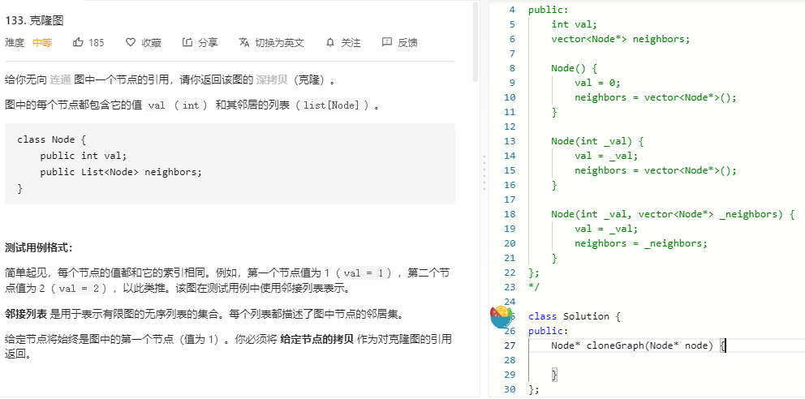

### 题目要求



### 解题思路

注意无向图的遍历和有向图的区别。有向图重要是找到入度为0的节点，做拓扑排序。无向图是要使用hash判断节点。

### 本题代码

#### BFS

```c++
class Solution {
public:
    Node* cloneGraph(Node* node) {
        unordered_map<Node*, Node*>m;
        if(node == NULL)
            return node;
        m[node] = new Node(node->val);
        queue<Node*>q;
        q.push(node);
        while(!q.empty()){
            Node* cur = q.front();
            q.pop();
            for(auto nei: cur->neighbors){
                if(m.find(nei) == m.end()){
                    m[nei] = new Node(nei->val);
                    q.push(nei);
                }   
                m[cur]->neighbors.push_back(m[nei]);
            }
        }
        return m[node];
    }
};
```

#### DFS

```c++
class Solution {
public:
    unordered_map<Node*, Node*>m;
    Node* cloneGraph(Node* node) {
        if(node == NULL)
            return node;
        if(m.find(node) != m.end())
            return m[node];
        m[node] = new Node(node->val);

        for(auto nei: node->neighbors){
            m[node]->neighbors.push_back(cloneGraph(nei));
        }
        return m[node]; 
        
    }
};
```

### [手撸测试](https://leetcode-cn.com/problems/clone-graph/solution/ke-long-tu-by-leetcode-solution/)  

