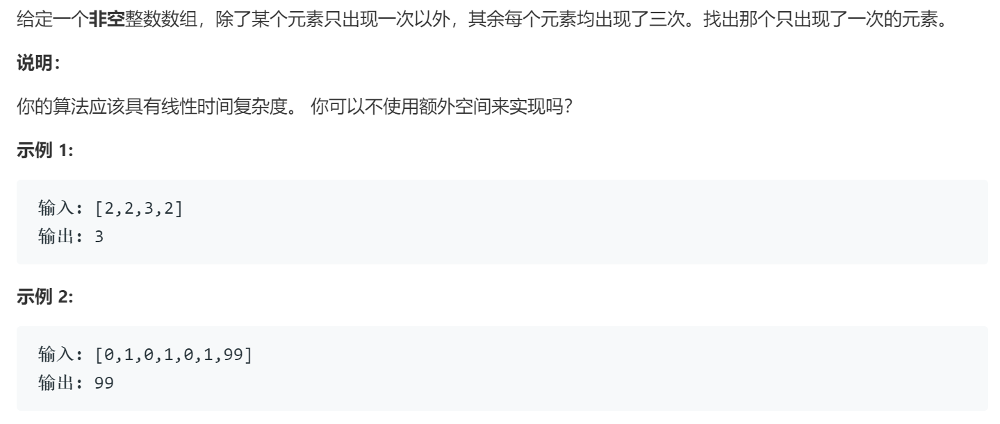

### 题目要求



### 解题思路

逐位法或者模拟三进制加法。

逐位法可以拓展到`n`位重复数中，思路是某一位如果出现三次该位和一定是3的倍数，如果去摸为1就是目标数在该位的数值。

模拟三进制法：三个状态`one`、`two`、`there`。`there`表示某数出现第三次，`one`、`two`表示某数出现一次或者两次。`two`变成1肯定是`one`为1且又出现`num`，`there`变1一定是`one`和`two`同时为1。这时需要把`there`置零。

### 本题代码

逐位法：

```c++
class Solution {
public:
    int singleNumber(vector<int>& nums) {
        int res = 0;
        for(int i = 0;i < 32;i++){
            int cnt = 0;
            for(auto num:nums){
                cnt += (num >> i) & 1;
            }
            res |= (cnt % 3) << i;
        }
        return res;
    }
};
```

模拟三进制法

```c++
class Solution {
public:
    int singleNumber(vector<int>& nums) {
        int one = 0, two = 0, there = 0;
        for(auto num:nums){
            two |= one & num;//某一位是否出现两次
            one ^= num;//某一位是否出现
            there = one & two;//某位同时为1 表示出现三次
            one &= ~there;//将出现三次的某一位置零
            two &= ~there;
        }
        return one;
    }
};
```

### [手撸测试](https://leetcode-cn.com/problems/single-number-ii/) 

