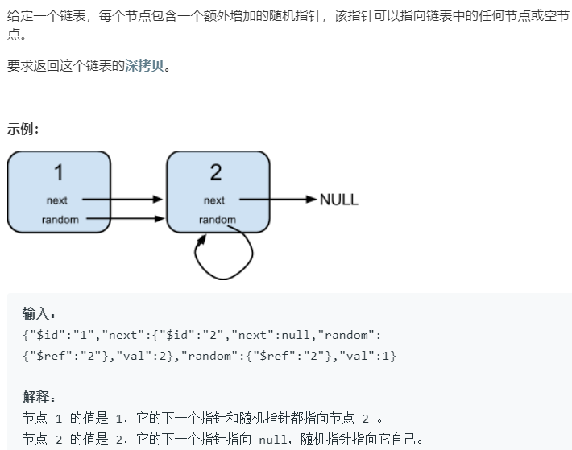

### 题目要求



### 解题思路

两种解法：一种是哈希表，另外一种是顺序copy然后连线拆分。

### 本题代码

#### 用哈希表解法

```c++
class Solution {
public:
    Node* copyRandomList(Node* head) {
        if(head == NULL)
            return head;
        map<Node*, Node*>m;
        Node* cur = head;
        while(cur != NULL){
            m[cur] = new Node(cur->val);
            cur = cur->next;
        }
        cur = head;
        while(cur != NULL){
            m[cur]->next = m[cur->next];
            m[cur]->random = m[cur->random];
            cur = cur->next;
        }
        return m[head];
        
    }
};
```

#### 顺序copy联线拆分

```c++
class Solution {
public:
    Node* copyRandomList(Node* head) {
        if(head == NULL)
            return head;
        Node* cur = head;
        Node* next = NULL;
        // 先拷贝 1->1`->2->2`->3->3`
        while(cur != NULL){
            next = cur->next;
            cur->next = new Node(cur->val);
            cur->next->next = next;
            cur = next;
        }
        cur = head;
        Node* copy = NULL;
        // 联random
        while(cur != NULL){
            next = cur->next->next;
            copy = cur->next;
            copy->random = cur->random != NULL ? cur->random->next : NULL;
            cur = next;
        }
        // 拆分
        Node* res = head->next;
        cur = head;
        while(cur != NULL){
            next = cur->next->next;
            copy = cur->next;
            copy->next = next != NULL ? next->next : NULL;
            cur = next;
        }
        return res;
    }
};
```

### [手撸测试](<https://leetcode-cn.com/problems/copy-list-with-random-pointer/>) 

