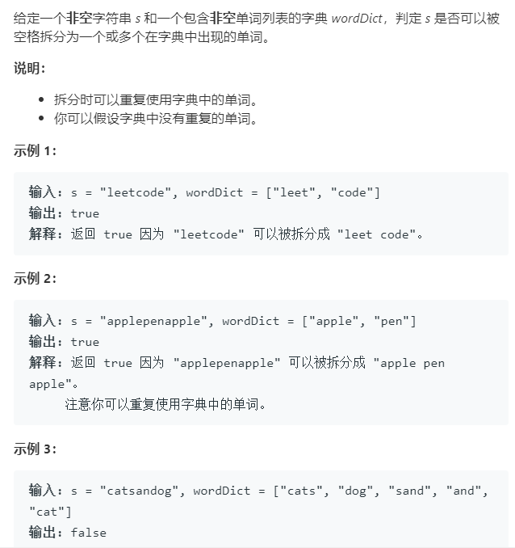

### 139 [单词拆分](https://leetcode-cn.com/problems/word-break/)

### 题目描述



### 解题思路

该方法的解题思路有很多，回溯法+剪枝、字典树、动态规划。这里只列举动态规划。

动态规划的思路是**截至到输入字符串`s`的第i个字符处是否能够被`wordDict`中的词构成**。举例来说即为：如果 `catsanddog` 可以拆分成两个子字符串 `catsand` 和 `dog` 。子问题 `catsand`可以进一步拆分成 `cats` 和 `and` ，这两个独立的部分都是字典的一部分，所以 `catsand`满足题意条件，再往前， `catsand`和 `dog` 也分别满足条件，所以整个字符串 `catsanddog` 也满足条件。因此动态规划表dp[i]的意思是s[0:i]子串能否被`wordDict`的词构成--那么为了求dp[i]，每次需要从0开始遍历分界点j，如果dp[j]和s[j:i] in `wordDict`那么dp[i] = true。

### 本题代码

```c++
class Solution {
public:
    bool wordBreak(string s, vector<string>& wordDict) {
        int n = s.size();
        bool dp[n + 1] = {false};
        unordered_set<string>st(wordDict.begin(), wordDict.end());
        dp[0] = true;
        for(int i = 1;i <= s.size();i++){
            for(int j = 0;j < i;j++){
                if(dp[j] && st.count(s.substr(j, i - j))){
                    dp[i] = true;
                    break;
                }
            }
        }
        return dp[n];
    }
};
```

