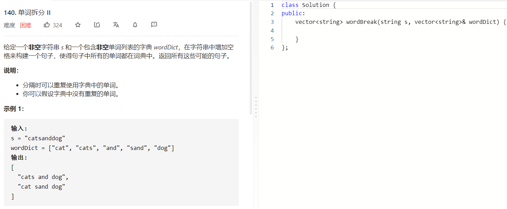

### 题目要求



### 解题思路

对于字符串 s，如果某个前缀是单词列表中的单词，则拆分出该单词，然后对 s 的剩余部分继续拆分。如果可以将整个字符串 s 拆分成单词列表中的单词，则得到一个句子。在对 s 的剩余部分拆分得到一个句子之后，将拆分出的第一个单词（即 s 的前缀）添加到句子的头部，即可得到一个完整的句子。上述过程可以通过回溯实现。

具体做法是，使用哈希表存储字符串 s 的每个下标和从该下标开始的部分可以组成的句子列表，在回溯过程中如果遇到已经访问过的下标，则可以直接从哈希表得到结果，而不需要重复计算。如果到某个下标发现无法匹配，则哈希表中该下标对应的是空列表，因此可以对不能拆分的情况进行剪枝优化。

helper函数的作用是记录该位置之后的所有的可能，所以将word填进ans每一个string中.

### 本题代码

```c++
class Solution {
public:
    unordered_map<int, vector<string>>ans;
    unordered_set<string>dict;
    vector<string> wordBreak(string s, vector<string>& wordDict) {
        dict = unordered_set(wordDict.begin(), wordDict.end());
        helper(s, 0);
        return ans[0];
    }
    void helper(string& s, int index){
        if(!ans.count(index)){
            if(index == s.size()){
                ans[index] = {""};
                return;
            }
            ans[index] = {};
            for(int i = index+1;i <= s.size();i++){
                string word = s.substr(index, i-index);
                if(dict.find(word) != dict.end()){
                    helper(s, i);
                    for(auto sub: ans[i]){
                        ans[index].push_back(sub.empty() ? word : word + " " + sub);
                    }
                }
            }
        }
    }
};
```

### [手撸测试](https://leetcode-cn.com/problems/word-break-ii/)  

