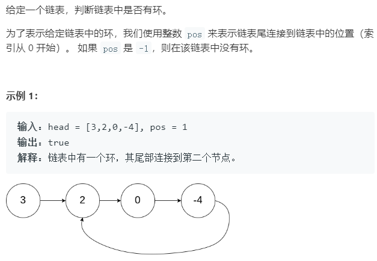

# 141 环形链表

## 题目描述



## 解题技巧

**解法一：**

快慢指针法，快指针走两步，慢指针走一步，当两者相遇则是有环。

**解法二：**

利用构建set。每次把节点添加入set之前，都先检查set中是否有该节点，如有则返回true，没有则添加该节点。

## 本题代码

解法一：

```cpp
class Solution {
public:
    bool hasCycle(ListNode *head) {
        ListNode* slow = head;
        ListNode* fast = head;
        while(fast != NULL){
            slow = slow->next;
            fast = fast->next;
            if(fast == NULL)
                return false;
            fast = fast->next;
            if(fast && slow == fast)
                return true;
        }
        return false;
    }
};
```

解法二：

```cpp
#include<set>
class Solution {
public:
    bool hasCycle(ListNode *head) {
        set<ListNode*>node_set;
        while(head){
            if(node_set.find(head) != node_set.end()){
                return true;
            }
            node_set.insert(head);
            head = head->next;
        }
        return false;
    }
};
```

