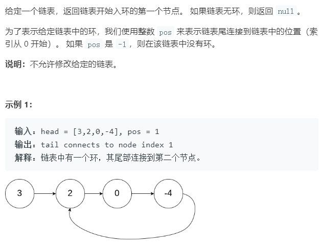
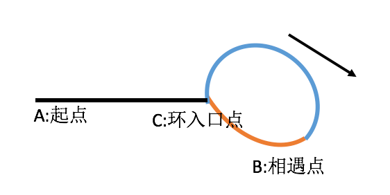

### 题目描述



### 解题技巧

Floyd 算法：



假设$x$为环前面的路程（黑色路程），a为环入口到相遇点的路程（蓝色路程，假设顺时针走）， c为环的长度（蓝色+橙色路程）当快慢指针相遇的时候：

此时慢指针走的路程为$S_{slow}$ = x + m * c + a
快指针走的路程为$S_{fast}$ = x + n * c + a
2 * $S_{slow}$ = $S_{fast}​$
2 * ( x + m * c + a ) = (x + n * c + a)
从而可以推导出：
x = (n - 2 * m) * c - a
   = (n - 2 * m -1 ) * c + c - a
即环前面的路程 = 数个环的长度（为可能为0） + c - a
什么是c - a？这是相遇后，环后面部分的路程。（橙色路程）所以，我们可以让一个指针从起点A开始走，让一个指针从相遇点B开始继续往后走，两个指针速度一样，那么，当从原点的指针走到环入口点的时候（此时刚好走了x）从相遇点开始走的那个指针也一定刚好到达环入口点。所以两者会相遇，且恰好相遇在环的入口点。

时间复杂度：O(n)

空间复杂度：O(1)

### 本题代码

```c++
class Solution {
public:
    ListNode *detectCycle(ListNode *head) {
        if(head == NULL)
            return head;
        ListNode* slow = head;
        ListNode* fast = head;
        while(fast){
            slow = slow->next;
            fast = fast->next;
            if(fast == NULL)
                return NULL;
            fast = fast->next;
            if(fast && fast == slow)
                break;
        }
        if(fast == NULL)
            return NULL;
        slow = head;//从开始出发
        while(fast != slow){
            fast = fast->next;
            slow = slow->next;
        }
        return fast;
    }
};
```

