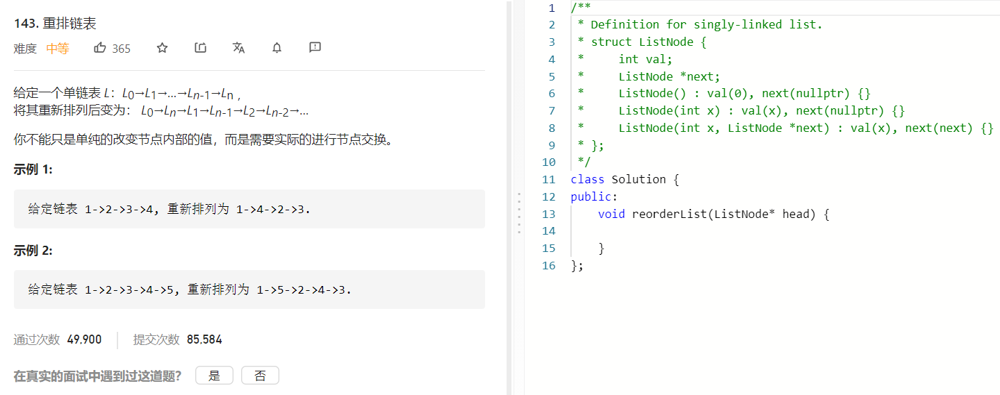

### 题目要求



### 解题思路

一半切分链表，然后重连即可。

### 本题代码

```c++
/**
 * Definition for singly-linked list.
 * struct ListNode {
 *     int val;
 *     ListNode *next;
 *     ListNode() : val(0), next(nullptr) {}
 *     ListNode(int x) : val(x), next(nullptr) {}
 *     ListNode(int x, ListNode *next) : val(x), next(next) {}
 * };
 */
class Solution {
public:
    void reorderList(ListNode* head) {
        if(head == NULL || head->next == NULL || head->next->next == NULL)
            return;
        stack<ListNode*>sk;
        ListNode* slow = head;
        ListNode* fast = head;
        while(fast != NULL && fast->next != NULL){
            slow = slow->next;
            fast = fast->next->next;
        }
        if(fast)
            slow = slow->next;
        while(slow){
            sk.push(slow);
            slow = slow->next;
        }
        slow = head;
        ListNode* next = NULL;
        while(!sk.empty()){
            next = slow->next;
            slow->next = sk.top();
            sk.top()->next = next;
            slow = next;
            sk.pop();
        }
        slow->next = NULL;
    }
};
```

### [手撸测试](https://leetcode-cn.com/problems/reorder-list/)  

