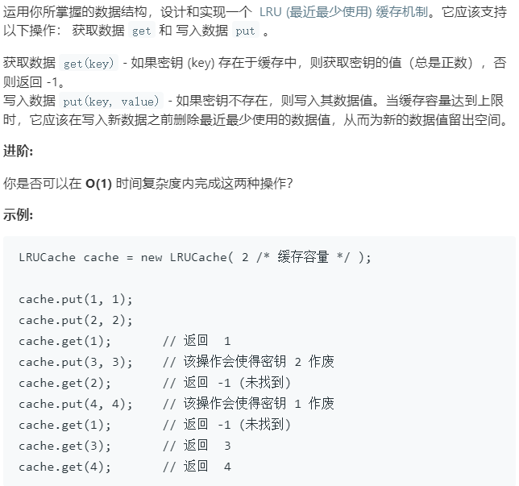

### 题目要求



### 解题思路

`LRU`就是数据按访问频率排序，访问越频繁，该访问数据排的越靠前。当数据量大于自身定义数据量时，删除排名靠后的数据。另外，查找需要$$O(1)$$，这就需要使用hash表。

方法是双向链表+hash。双向链表节点需要有key和value，自然pre和next也要存在。hash的key是密匙，value是双线链表节点。完成题目所给的要求还需要设计一个双向链表的数据结构`cache`(不是双向链表节点)，它维护的是数据，也就是数据是通过双向链表组织的。`cache`的方法有：得到整个数据大小`getSize()`(最大是题目`LRU`的大小)，删除最后节点`removeLast()`(当数据大小大于`LRU`定义的大小时)，删除链表中某一个节点`remove(Node* node)`(数据在hash中也要删除)，头节点插入`addFirst(Node* node)`(访问越频繁，排名越靠前--也就是`LRU`访问存在的数据时要更新该数据的顺序)。

### 本题代码

```c++
class Node{
    public:
    int key;
    int val;
    Node* pre;
    Node* next;
    Node(int k, int v):key(k),val(v),pre(NULL),next(NULL){}
};

class cache{
    private:
        int size;
        Node* head;
        Node* tail;
    public:
    cache(int cap = 0){
        size = cap;
        head = new Node(0, 0);
        tail = new Node(0, 0);//定义开始和结尾标志。
        head->next = tail;
        tail->pre = head;
        head->pre = NULL;
        tail->next = NULL;
    }
    void addFirst(Node* node){
        Node* next = head->next;
        node->next = next;
        next->pre = node;
        head->next = node;
        node->pre = head;
        size++;
        return;
    }
    void remove(Node* node){//尾节点一定存在
        Node* next = node->next;
        node->pre->next = next;
        next->pre = node->pre;
        size--;
    }
    Node* removeLast(){
        if(tail->pre == head)
            return NULL;
        Node* last = tail->pre;
        remove(last);
        return last;
    }
    int getSize(){
        return size;
    }
};
class LRUCache {
public:
    int cap;
    cache ls;
    map<int, Node*>m;
    LRUCache(int capacity) {
        cap = capacity;
        ls = cache();
    }
    
    int get(int key) {
        if(m.find(key) == m.end())
            return -1;
        int value = m[key]->val;
        put(key, value);// 访问时要将该数据提前
        return value;
    }
    
    void put(int key, int value) {
        Node* node = new Node(key, value);
        if(m.count(key) != 0){
            ls.remove(m[key]);
        }
        else{
            if(cap == ls.getSize()){
                Node* last = ls.removeLast();
                m.erase(last->key);     
            }
        }
        ls.addFirst(node);
        m[key] = node;   
    }
};
```

### [手撸测试](https://leetcode-cn.com/problems/lru-cache/) 

