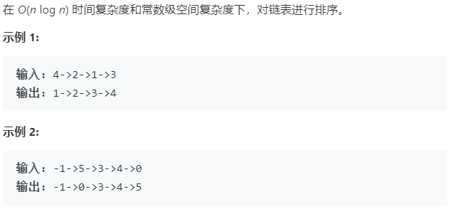

### 题目要求



### 解题思路

本题是对排序算法的扩展应用，核心思路就是归并排序。题目要求是在**常数级空间复杂度**下对链表进行排序，那么就要写成迭代式。但是为了全面理解归并排序，需要写出递归和迭代式两种。

#### 解法一 递归归并排序

思路就是不停二分，然后合并。因为是链表(不像数组)，这里的二分点的找法需要技巧。熟练手写以下代码:

```c++
// 对于链表head 如何找到其中点节点
ListNode* Head = new ListNode(0);
ListNode* fast = Head;
ListNode* slow = Head;
while(fast !=NULL && fast->next != NULL){
    fast = fast->next->next;
    slow = slow->next;
}
// 这时退出循环的slow就是以head为头节点链表的中点
```

关于合并两链表也需要建立一个`dummy`指针，具体看代码。

#### 解法二 迭代归并排序


### 本题代码

#### 解法一 递归式 

```c++
// 时间复杂度 O(n log n) 空间复杂度 O(logn) 因为要做logn次递归
class Solution {
public:
    ListNode* sortList(ListNode* head) {
        return mergeSort(head);
    }
    ListNode* mergeSort(ListNode* head){
        if(head == NULL || head->next == NULL)
            return head;
        ListNode* Head = new ListNode(0);
        Head->next = head;
        ListNode* fast = Head;
        ListNode* slow = Head;
        while(fast != NULL && fast->next != NULL){
            fast = fast->next->next;
            slow = slow->next;
        }//找到中点节点
        ListNode* head2 = slow->next;
        slow->next = NULL;// 分成两部分
        head = mergeSort(head);
        head2 = mergeSort(head2);
        return merge(head, head2);
    }
    ListNode* merge(ListNode* head1, ListNode* head2){
        ListNode* Head = new ListNode(0);
        ListNode* tail = Head;
        while(head1 != NULL && head2 != NULL){
            if(head1->val < head2->val){
                tail->next = head1;
                tail = tail->next;
                head1 = head1->next;
            }
            else{
                tail->next = head2;
                tail = tail->next;
                head2 = head2->next;
            }
        }
        if(head1 != NULL)
            tail->next = head1;
        if(head2 != NULL)
            tail->next = head2;
        return Head->next;
    }
};
```

#### 解法二 迭代式


### [手撸测试](https://leetcode-cn.com/problems/sort-list/) 

