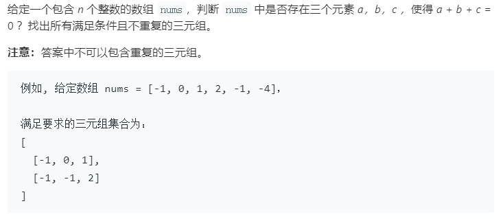

### 题目要求



### 解题思路

三数之和以及两数之和的大思路上都有一些相像。首先就是固定一个数，在考虑条件。三数之和，先排序然后遍历整个数组，遍历到该元素`nums[i]`后，先判断`nums[i]`，如果大于`0`就直接返回(后面相加不可能等于0)，如果和前一个值`nums[i - 1]`一样那么就跳过(防止重复)。接着左右指针开始从`i + 1`和`nums.size() - 1`扫描，如果大于0就右指针动，如果小于0就左指针动，如果相等就加入`res`中，三个需要考虑一件事情--跳过重复值。

### 本题代码

```c++
class Solution {
public:
    vector<vector<int>> threeSum(vector<int>& nums) {
        if(nums.size() < 3)
            return vector<vector<int>>();
        vector<vector<int>>res;
        sort(nums.begin(), nums.end());
        int i = 0;
        int j = 0;
        int sum = 0;
        for(int k = 0;k < nums.size() - 2;k++){
            if(nums[k] > 0)
                break;
            if(k > 0 && nums[k] == nums[k-1])
                continue;
            i = k + 1;
            j = nums.size() - 1;
            while(i < j){
                sum = nums[k] + nums[i] + nums[j];
                if(sum < 0){
                    while(i < j && nums[i] == nums[++i]);
                }
                else if(sum > 0){
                    while(i < j && nums[j] == nums[--j]);
                }
                else{
                    res.push_back({nums[k], nums[i], nums[j]});
                    while(i < j && nums[i] == nums[++i]);
                    while(i < j && nums[j] == nums[--j]);
                }
            }
        }
        return res;
    }
};
```

### [手撸测试](<https://leetcode-cn.com/problems/3sum/>) 

