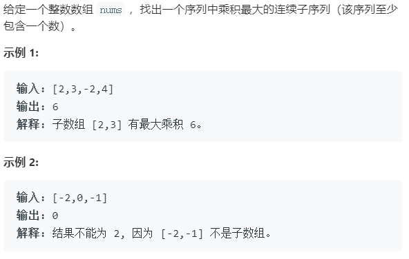

### 题目要求



### 解题思路

这道题可以和【最大连续子序列和】一起复习，套路都是有些相似，关键是如何处理当`nums[i]`小于0的情况。解题框架自然是老生常谈的动态规划：每一步都维护一个最大值以及最小值，细节在于当`nums[i]`小于0时，最大值乘以`nums[i]`变为最小值，最小值乘以`nums[i]`变成最大值，因此当`nums[i]`小于0需要交换最大值以及最小值用于计算当前步的最大值和最小值。

### 本题代码

```c++
class Solution {
public:
    int maxProduct(vector<int>& nums) {
        if(nums.size() == 0)
            return 0;
        int res = INT_MIN;
        int imin = 1;
        int imax = 1;
        for(int i = 0;i < nums.size();i++){
            if(nums[i] < 0){
                int temp = imax;
                imax = imin;
                imin = temp;
            }
            imax = max(imax * nums[i], nums[i]);
            imin = min(imin * nums[i], nums[i]);
            res = max(res, imax);
        }
        return res;
    }
};
```

### [手撸测试](https://leetcode-cn.com/problems/maximum-product-subarray/) 

