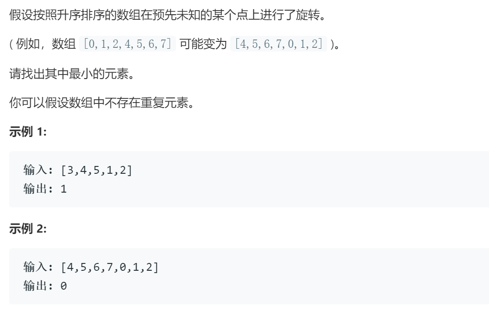

### 题目要求



### 解题思路

旋转数组的思路就是二分法找其旋转点也称为断点。如果一个有序数组经过旋转后，最小的值一定是数组中降序的那个位置，其余部分都是升序。同时，数组的第一个元素一定比最后一个元素大。如果没有经过旋转，数组整体都是升序，最小值就是数组的第一个值。所以在利用二分查找的时候，如果`arr[left] < arr[right]`，说明数组整体升序，直接返回`arr[left]`。否则，如果`arr[left] > arr[mid]`，说明降序一定发生在数组左半区，令`right = mid`；如果`arr[mid] > arr[right]`，说明降序一定发生在数组右半区，令`left = mid`。但是有一个很重要的问题，在arr数组中可能存在重复的值，那么就可能发生`arr[left] == arr[mid] == arr[right]`的情况。这个时候，我们从`left`位置开始，向右遍历，假设遍历到位置`i`，如果`arr[i] == arr[mid]`，继续向右遍历；如果`arr[i] > arr[mid]`，说明降序一定发生在`arr[i…mid]`之间，令`left = i，right = mid`；如果`arr[i] < arr[mid]`，说明此时出现了降序，直接返回`arr[i]`即可。如果遍历到`mid`位置都一直与`arr[mid]`相等，说明左半区都是一个值，所以降序一定出现在右半区，所以令`left = mid`。最坏的情况下，所有的值都是一个值。对于每个值都需要遍历一遍，所以最坏的时间复杂度是O(N)。

### 本题代码

```c++
class Solution {
public:
    int findMin(vector<int>& nums) {
        if(nums.size() == 0)
            return -1;
        int left = 0, right = nums.size() - 1;
        while(left < right){
            if(left == right - 1)
                break;
            if(nums[left] < nums[right])
                return nums[left];
            int mid = left + (right - left) / 2;
            if(nums[left] > nums[mid]){
                right = mid;
                continue;
            }
            if(nums[mid] > nums[right]){
                left = mid;
                continue;
            }
            while(left < right){
                if(nums[left] == nums[mid]){
                    left++;
                }
                else if(nums[left] < nums[mid]){
                    return nums[left];
                }
                else{
                    right = mid;
                    break;
                }
            }
        }
        return min(nums[left], nums[right]);
    }
};
```

### [手撸测试](https://leetcode-cn.com/problems/find-minimum-in-rotated-sorted-array/)  

