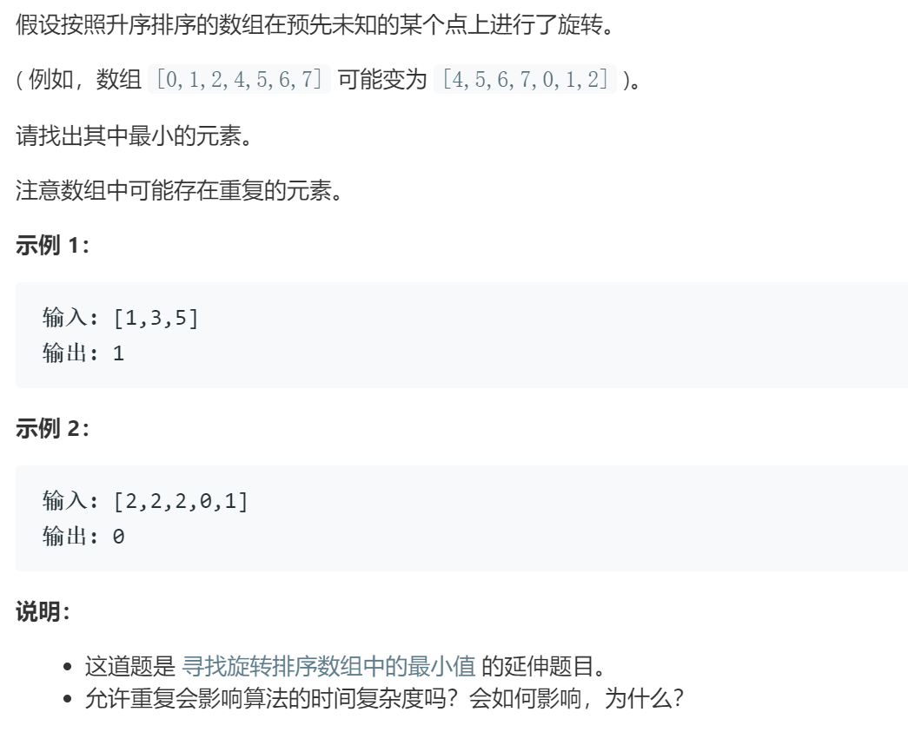

### 题目要求



### 解题思路

参考[Leetcode 153](153.md)。 

### 本题代码

```c++
class Solution {
public:
    int findMin(vector<int>& nums) {
        if(nums.size() == 0)
            return -1;
        int left = 0, right = nums.size() - 1;
        while(left < right){
            if(left == right - 1)
                break;
            if(nums[left] < nums[right])
                return nums[left];
            int mid = left + (right - left) / 2;
            if(nums[left] > nums[mid]){
                right = mid;
                continue;
            }
            if(nums[mid] > nums[right]){
                left = mid;
                continue;
            }
            while(left < right){
                if(nums[left] == nums[mid]){
                    left++;
                }
                else if(nums[left] < nums[mid]){
                    return nums[left];
                }
                else{
                    right = mid;
                    break;
                }
            }
        }
        return min(nums[left], nums[right]);
    }
};
```

### [手撸测试](https://leetcode-cn.com/problems/find-minimum-in-rotated-sorted-array-ii/) 
