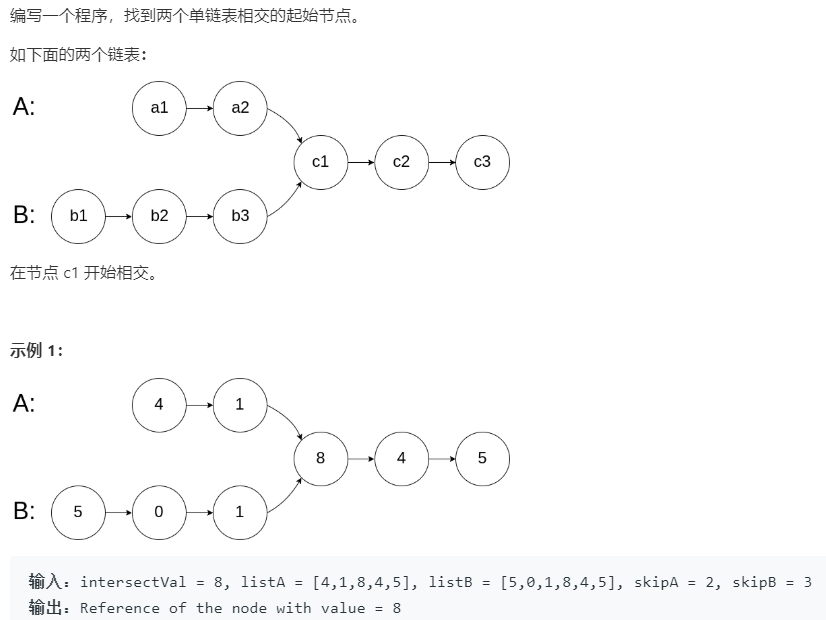

### 题目要求



### 解题思路

简单题，直接使用两个栈分别压入两个链表，从后面以此判断直到遇到不相等的节点即为相交界点

### 本题代码

```c++
class Solution {
public:
    ListNode *getIntersectionNode(ListNode *headA, ListNode *headB) {
        stack<ListNode*>s1;
        stack<ListNode*>s2;
        while(headA){
            s1.push(headA);
            headA = headA->next;
        }
        while(headB){
            s2.push(headB);
            headB = headB->next;
        }
        ListNode* res = NULL;
        while(!s1.empty() && !s2.empty()){
            if(s1.top() != s2.top()){
                return res;
            }
            res = s1.top();
            s1.pop();
            s2.pop();
        }
        return res;
    }
};
```


### [手撸测试](https://leetcode-cn.com/problems/intersection-of-two-linked-lists/)

