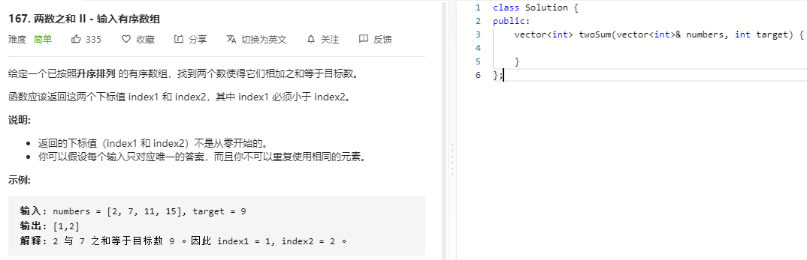

### 题目要求



### 解题思路

直接手撸，参考 [两数之和](1.md) 

### 本题代码

```c++
class Solution {
public:
    vector<int> twoSum(vector<int>& numbers, int target) {
        int i = 0, j = numbers.size() - 1;
        while(i < j){
            int sum = numbers[i] + numbers[j];
            if(sum < target)
                i++;
            else if(sum > target)
                j--;
            else{
                return {i+1, j+1};
            }
        }
        return {};
    }
```

### [手撸测试](https://leetcode-cn.com/problems/two-sum-ii-input-array-is-sorted/) 

