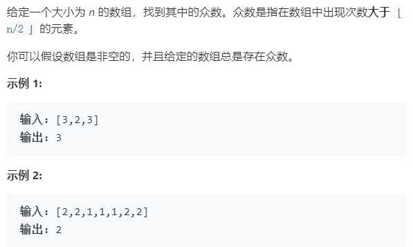

### 题目要求



### 解题思路

#### 解法一

使用哈希表统计次数然后判断。

#### 解法二

摩尔投票，一个数组中出现次数大于$$n/2$$ 的数有且仅有一个，需要`condi`以及`time`。不过有一个细节，需要判断出最后的结果是否满足大于$$ n/2 $$ 。

### 本题代码

#### 哈希表计数 

```c++
class Solution {
public:
    int majorityElement(vector<int>& nums) {
        map<int,int>m;
        for(int i = 0;i < nums.size();i++){
            m[nums[i]]++;
        }
        int res = 0;
        for(int i = 0;i < nums.size();i++){
            if(2 * m[nums[i]] > nums.size()){
                res = nums[i];
                break;
            }
                
        }
        return res;
    }
};
```

#### 摩尔投票

```c++
class Solution {
public:
    int majorityElement(vector<int>& nums) {
        if(nums.size() == 0)
            return 0;
        int condi = nums[0];
        int time = 1;
        for(int i = 1;i < nums.size();i++){
            if(time == 0){
                time++;
                condi = nums[i];
            }
            else{
                if(nums[i] == condi)
                    time++;
                else
                    time--;
            }
        }
        time = 0;
        for(int i = 0;i< nums.size();i++){
            if(nums[i] == condi)
                time++;
        }
        if(2 * time > nums.size())
            return condi;
        else
            return 0;
    }
};
```


### [手撸测试](https://leetcode-cn.com/problems/majority-element/) 