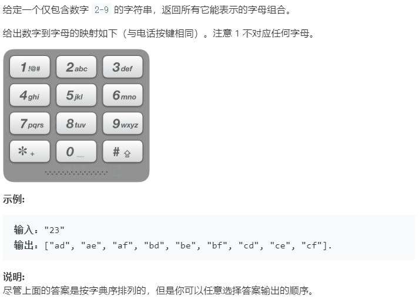

### 题目要求



### 解题思路

比较复杂的全排列与回溯的结合，一般全排列是有固定的模板的，该题需要将模板里满足长度的要求改一下。

### 本题代码

```c++
class Solution {
public:
    void InitNum(){
        m['2'] = "abc";
        m['3'] = "def";
        m['4'] = "ghi";
        m['5'] = "jkl";
        m['6'] = "mno";
        m['7'] = "pqrs";
        m['8'] = "tuv";
        m['9'] = "wxyz";
    }
    void helper(string& digits, string& phone_number, vector<string>& res){
        if(digits.size() == phone_number.size())
            res.push_back(phone_number);
        else{
            for(char c : m[digits[phone_number.size()]]){
                phone_number.push_back(c);
                helper(digits, phone_number, res);
                phone_number.pop_back();
            }
        }
    }
    vector<string> letterCombinations(string digits) {
        if(digits.size() == 0)
            return vector<string>();
        InitNum();
        string phone_number;
        vector<string>res;
        helper(digits, phone_number, res);
        return res;
    }
    private:
    unordered_map<char, string> m;
};
```

### [手撸测试](<https://leetcode-cn.com/problems/letter-combinations-of-a-phone-number/>) 

