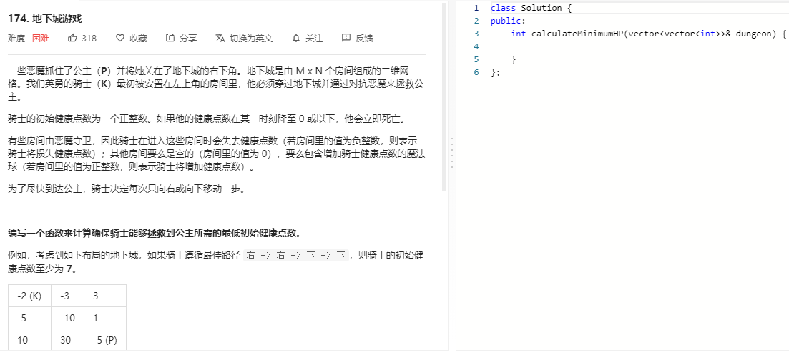

### 题目要求



### 解题思路

相似的题目有 [offer12 矩阵路径](offer12.md)、[64 最小路径和](64.md)。该题需要逆向思维，从右下退回左上。具体需要建立`dp[i][j]`(表示的是到达第$$(i,j)$$时所需的最小生命值)，因此`dp`大小是(n+1,m+1)，且初始化最低为1(`dp[n-1][m-1]`最低为1)。

### 本题代码

```c++
class Solution {
public:
    int calculateMinimumHP(vector<vector<int>>& dungeon) {
        if(dungeon.size() == 0)
            return 0;
        int n = dungeon.size();
        int m = dungeon[0].size();
        vector<vector<int>>dp(n+1, vector<int>(m+1, INT_MAX));
        dp[n][m-1] = dp[n-1][m] = 1;
        int res = 0;
        for(int i = n-1;i >= 0;i--){
            for(int j = m-1;j >= 0;j--)
                dp[i][j] = max(min(dp[i+1][j], dp[i][j+1]) - dungeon[i][j], 1);
        }
        return dp[0][0];
    }
};
```

### [手撸测试](https://leetcode-cn.com/problems/dungeon-game/)  

