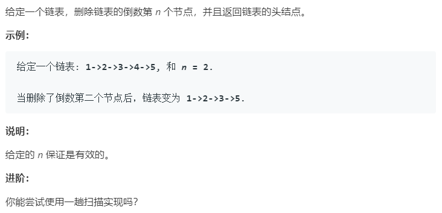

### 题目要求



### 解题思路

从头遍历一遍，遍历的时候n--，然后根据n的大小不同删除对应的节点。

### 本题代码

```c++
class Solution {
public:
    ListNode* removeNthFromEnd(ListNode* head, int n) {
        if(head == NULL)
            return head;
        ListNode* cur = head;
        while(cur != NULL){
            n--;
            cur = cur->next;
        }
        if(n > 0)
            return head;
        if(n == 0)
            return head->next;
        cur = head;
        while(++n != 0)
            cur = cur->next;
        cur->next = cur->next->next;
        return head;
    }
};
```

### [手撸测试](<https://leetcode-cn.com/problems/remove-nth-node-from-end-of-list/>) 
