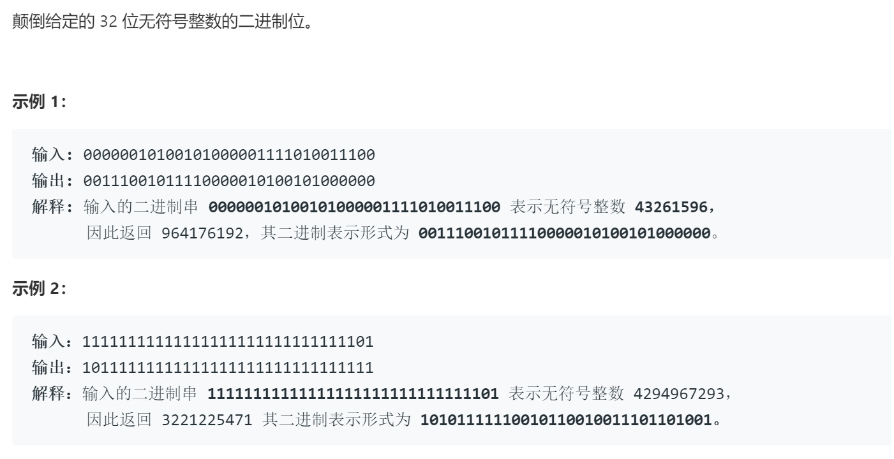

### 题目要求



### 解题思路

循环32次，结果计算保持在`res`中，每次左移一位最低位为0；`n`每次最低位和`res`相加之后向右移动一位。

### 本题代码

```c++
class Solution {
public:
    uint32_t reverseBits(uint32_t n) {
        int count = 0;
        int res = 0;
        while(count < 32){
            res <<= 1;
            res |= (n & 1);
            n >>= 1;
            count++;
        }
        return res;
    }
};
```

### [手撸测试](https://leetcode-cn.com/problems/reverse-bits/)  

