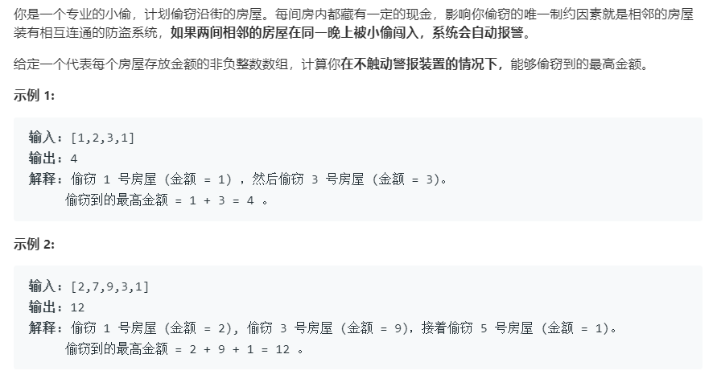

### 题目要求



### 解题思路

动态规划解法，考虑状态转移方程是关键。对于`nums`数组，首先看`n = 1`的情况，显然$$f(1) = nums[0]$$ 。再看`n = 2`，$$f(2) = max(nums[0],nums[1])$$。对于 n = 3，有两个选项:

- 抢第三个房子，将数额与第一个房子相加。

- 不抢第三个房子，保持现有最大数额。

显然，你想选择数额更大的选项。于是，可以总结出公式：$$f(k) = max(f(k – 2) + nums[i] , f(k – 1))$$。我们选择$$f(–1) = f(0) = 0$$为初始情况，这将极大地简化代码。

### 本题代码

```c++
class Solution {
public:
    int rob(vector<int>& nums) {
        if(nums.size() == 0)
            return 0;
        int curMax = 0;
        int preMax = 0;
        for(auto x : nums){
            int temp = curMax;
            curMax = max(preMax + x, curMax);
            preMax = temp;
        }
        return curMax;   
    }
};
```

### [手撸测试](https://leetcode-cn.com/problems/house-robber/submissions/)
