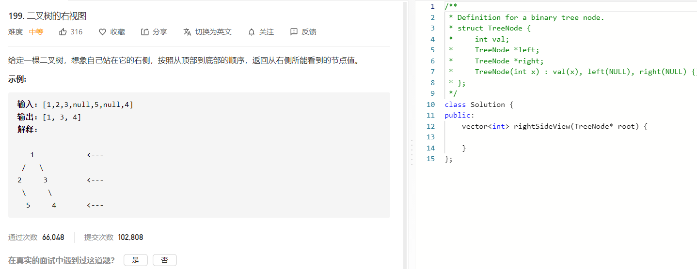

### 题目要求



### 解题思路

右视图，直接层次遍历，每一层最后一个节点就是右视图。

### 本题代码

```c++
class Solution {
public:
    vector<int> rightSideView(TreeNode* root) {
        if(root == NULL)
            return vector<int>();
        vector<int>res;
        queue<TreeNode*>q;
        q.push(root);
        while(!q.empty()){
            int size = q.size();
            for(int i = 0;i < size;i++){
                TreeNode* node = q.front();
                if(i == size-1)
                    res.push_back(node->val);
                if(node->left)
                    q.push(node->left);
                if(node->right)
                    q.push(node->right);
                q.pop();
            }
        }
        return res;
    }
};
```

### [手撸测试](https://leetcode-cn.com/problems/binary-tree-right-side-view/)  

