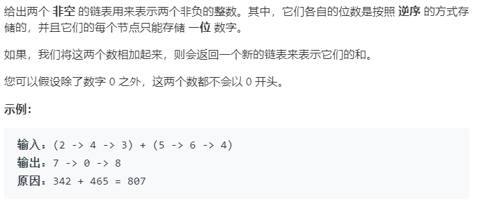

### 题目要求



### 解题思路

简单题直接相加就可以，主要是需要考虑进位。另外，链表建立头节点的方法也要牢记。

### 本题代码

```c++
class Solution {
public:
    ListNode* addTwoNumbers(ListNode* l1, ListNode* l2) {
        ListNode* Head = new ListNode(0);
        ListNode* cur = Head;
        ListNode* next = NULL;
        int flag = 0;
        while(l1 || l2){
            int x = l1 ? l1->val : 0;
            int y = l2 ? l2->val : 0;
            int sum = x + y + flag;
            next = new ListNode(sum % 10);
            flag = sum / 10;
            cur->next = next;
            cur = next;
            l1 = l1 ? l1->next : l1;
            l2 = l2 ? l2->next : l2;
        }
        if(flag){//考虑进位
            cur->next = new ListNode(1); 
        }
        return Head->next;
    }
};
```

### [手撸测试](<https://leetcode-cn.com/problems/add-two-numbers/>) 

