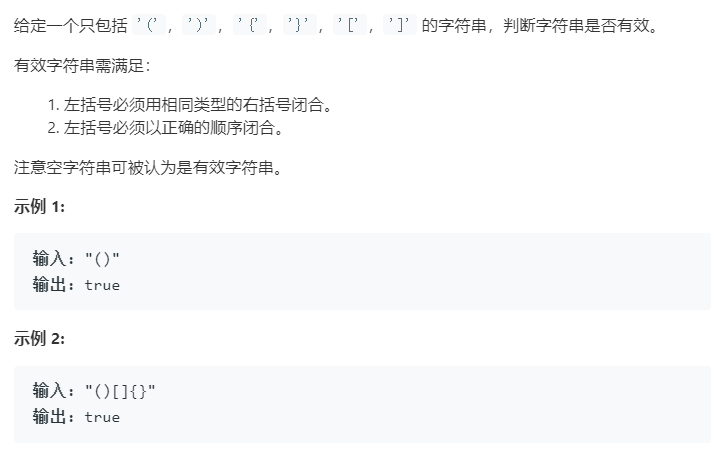

### 题目要求



### 解题思路

直接使用栈的先入后出来判断，如果栈为空而且碰到右括号那么直接返回`false`，如果栈不为空，而且是`)`、`]`、`}`就有两种情况，如果该元素和栈顶元素的ascii码相差1或者2那么就可以弹出栈顶，负责返回为`false`。如果是`{`、`(`、`[`且栈为空就直接压入。最后遍历完看看栈是否为空，为空就为有效括号。

### 本题代码

```c++
class Solution {
public:
    bool isValid(string s) {
        if(s.size() == 0)
            return true;
        stack<char>sk;
        for(int i = 0;i < s.size();i++){
            if(sk.empty() && (s[i] == ')' || s[i] == ']' || s[i] == '}'))
                return false;
            if(s[i] == ')' || s[i] == ']' || s[i] == '}'){
                if(s[i] - sk.top() == 1 || s[i] - sk.top() == 2)
                    sk.pop();
                else
                    return false;
            }
            else
                sk.push(s[i]);
        }
        return sk.empty();
    }
};
```

### [手撸测试](<https://leetcode-cn.com/problems/valid-parentheses/>) 
