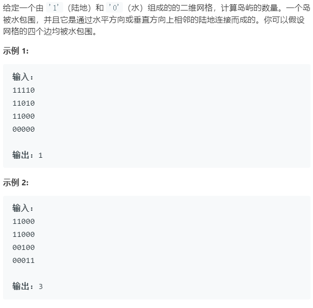

### 题目要求



### 解题思路

带状态标记的深度优先搜索。当`grid[i][j]`为`1`时，搜索其上下左右，要是超出边界或者不为`1`时返回；否则则在`grid[i][j]`处mark。

### 本题代码

```c++
class solution{
    int numIslands(vector<vector<char>>& grid){
        int res = 0;
        for(int i = 0;i < grid.size();i++){
            for(int j = ;j < grid[0].size();j++){
                if(grid[i][j] == '1'){
                    res++;
                    dfs(grid, i, j);
                }
            }
        }
        return res;
    }
    void dfs(vector<vector<char>>& grid, int i, int j){
        if(i < 0 || i >= grid.size() || j < 0 || j >= grid[0].size() || grid[i][j] != '1')
            return;// 要么超出边界 要么搜索过M 要么是0
        grid[i][j] = 'M';
        dfs(grid, i + 1, j);
        dfs(grid, i - 1, j);
        dfs(grid, i, j + 1);
        dfs(grid, i, j - 1);
    }
}
```


### [手撸挑战](https://leetcode-cn.com/problems/number-of-islands/)

